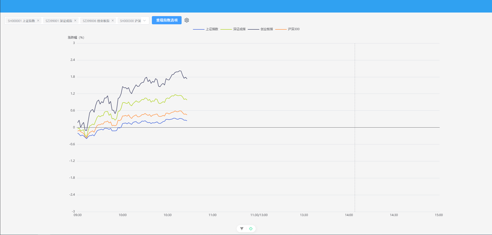
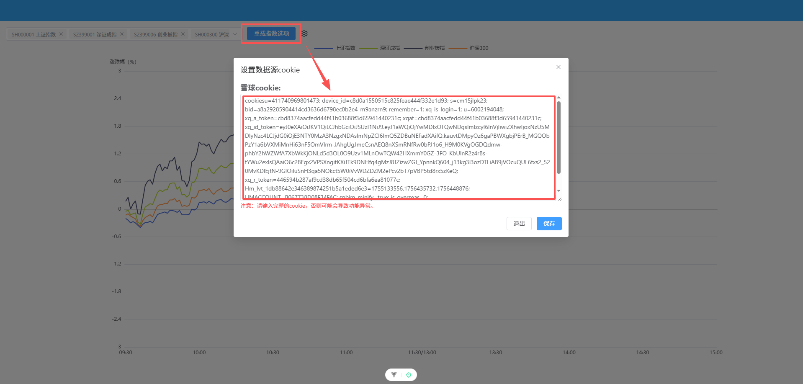

# multi_market
多行情曲线合并

> 项目介绍：
> 
> 基于vue3.x + echarts5.x + ts4.x + vite2.x + element-plus 开发的多行情曲线合并项目，主要功能有：
> 
> 多行情曲线合并：支持多市场多品种多周期的行情曲线合并，并可自定义显示的指标。

## vue3 项目
> vue版本：3.5.18
> 
> nodejs版本：大于等于22.12 或 大于等于 20.19
> 

## 主页展示

## 设置数据来源Cookie

